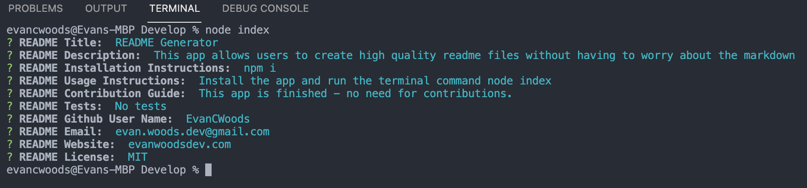

# README Generator

## License

https://opensource.org/licenses/MIT

## Table of Contents
* [Description](#description) 
* [Installation Instructions](#installation)
* [Usage Instructions](#usage)
* [Contribution Guide](#contribute)
* [Tests](#tests)
* [Questions](#questions)

## Description
This app is the "University of Sydney's Full Stack Flex Bootcamp" week 9 Homework. The project is a readme file generator which allows users to create a high quality readme file without having to worry about markup. The file is created by adding user input in the terminal to a set of boiler plate markdown that is then added to a readme file that is generated using the fs dependancy.

This project utelises new skills form the course such as imports and exports, the file system, external packages such as inquirer, and node. The code base is purely JavaScript and runs in the terminal using node.

Future improvements for this app include:
* Adding a set of logic to handle photos in a set folder and displaying them in the file.
* Deploying the project to be used in npm in the future.

## Installation
To Install and run this application yourself, follow the below step(s).

    npm i

## Usage
Install the app using the above instructions and run the terminal command "node index", or "node ."

See a demonstration of the app at the following link:
https://watch.screencastify.com/v/FTLjZoMrQN3tzPWPjiqe 

The app is a simple command line interface that looks as follows when completed:

## Contribute
This app is finished - no need for contributions.

## Questions
For any questions about the code please see my github for source code, email me at the address provided, or find my social media links on my portfolio website. 
* https://github.com/EvanCWoods
* evan.woods.dev@gmail.com
* https://evancwoods.github.io/Evan-Woods-Portfolio/